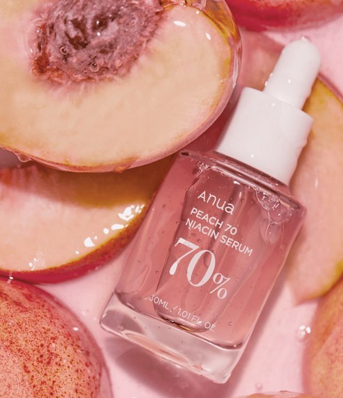
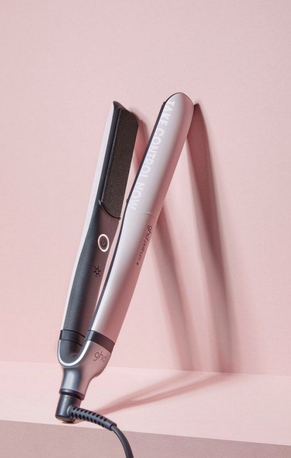
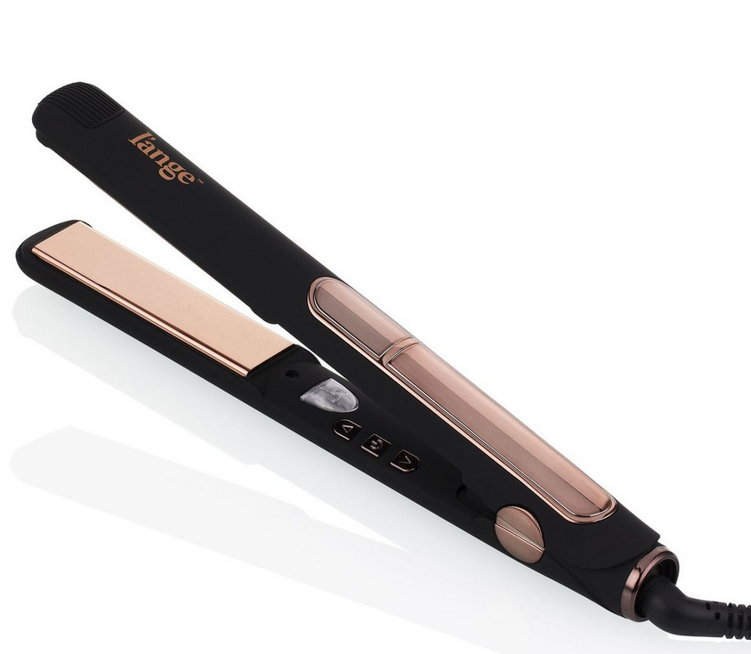
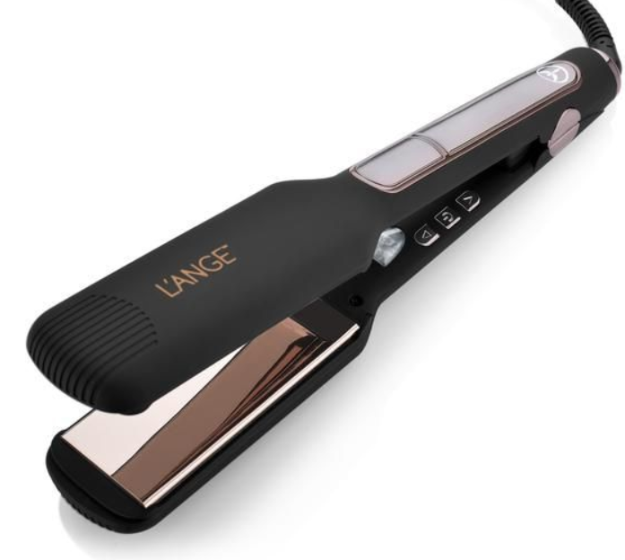
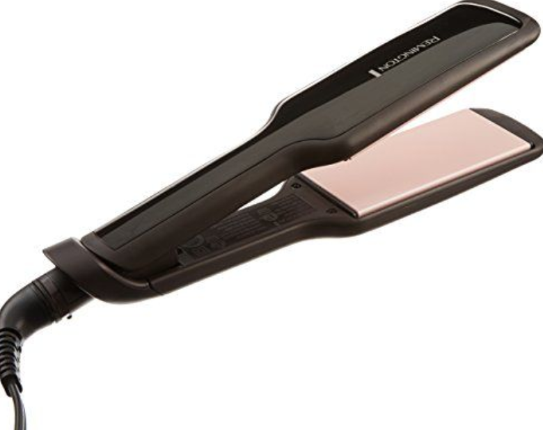
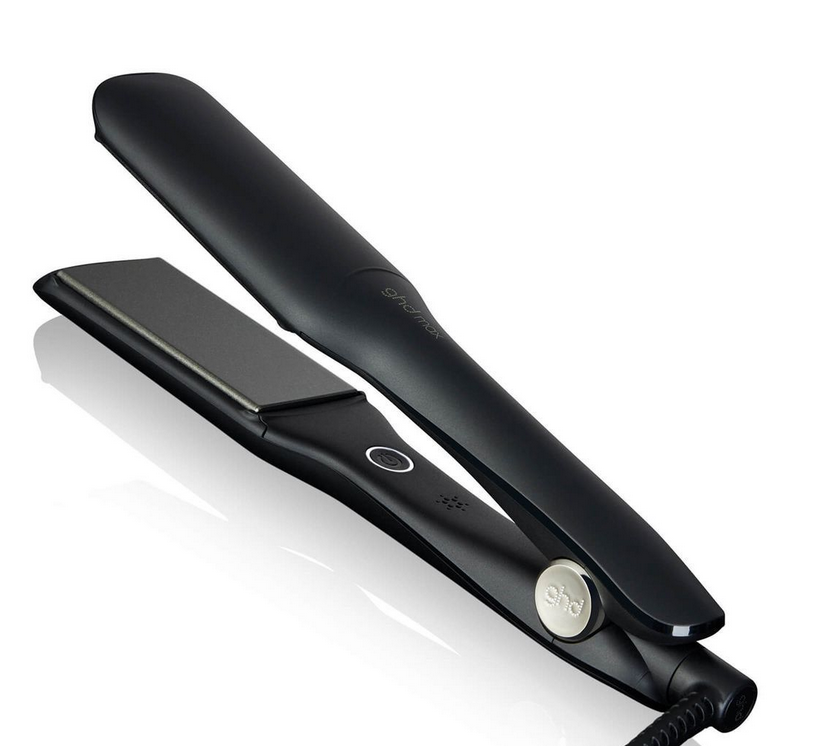
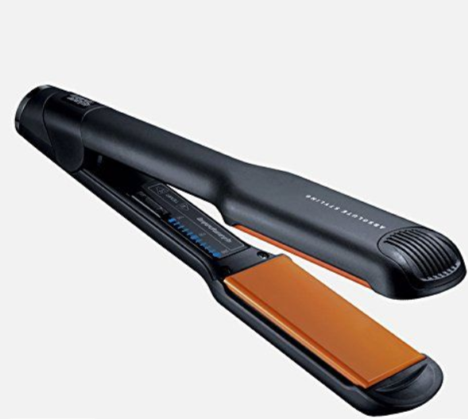
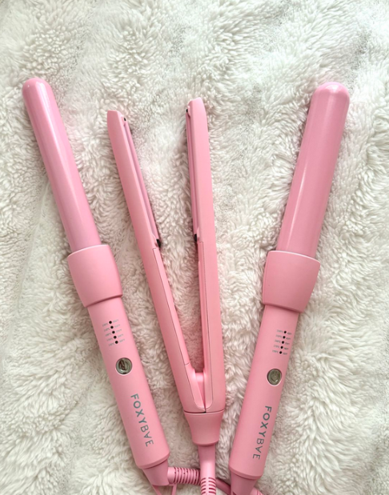
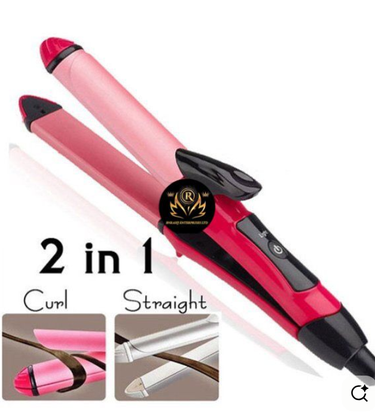
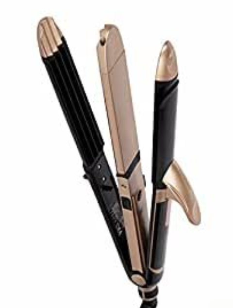

<!DOCTYPE html>
<html lang="en">
<head>
    <meta charset="UTF-8">
    <meta name="viewport" content="width=device-width, initial-scale=1.0">
    <title>Luxury Hair Straightener</title>
    <link rel="stylesheet" href="style.css">
</head>

<body>
   <header>
  <nav class="navbar">
    
LuxeStraight

    <ul class="nav-links">
      <li><a href="#home">Home</a></li>
      <li><a href="#about">About</a></li>
      <li><a href="#features">Features</a></li>
      <li><a href="#products">Products</a></li>
      <li><a href="#contact">Contact</a></li>
    </ul>

    <a href="#contact" class="menu-btn">buy now</a>
  </nav>
</header>

    <!-- HOME SECTION -->
  <!-- HOME SECTION -->
<section id="home" class="home">
  

  

    <h1>Luxury Hair Straightener</h1>
    
Experience salon-perfect smoothness at home with our advanced SilkPro Care and ceramic shine technology.

    <a href="#products" class="shop-btn">Shop Now</a>
  

</section>

    <!-- ABOUT SECTION -->
    <section id="about" class="about">
  <h2>About Us</h2>
  

    Discover the elegance of effortless styling with <strong>LuxeStraight</strong>.  
    Our advanced hair straighteners combine SilkPro Care and Ceramic Shine Technology
    to deliver salon-perfect smoothness while protecting your natural hair glow.
  

  

    

      <h3>💝 30% Off</h3>
      
On all premium models

    

    

      <h3>✨ Free Delivery</h3>
      
On orders above ₹999

    

    

      <h3>🎁 Combo Offers</h3>
      
Buy 1 Get 1 on select items

    

  

</section>

<section class="serum-offer">
  

    
    

      <h2>Heat Protection Beauty Sale</h2>
      <h3>Up to 40% OFF</h3>

      

        Prep your hair before styling with our lightweight heat-protect serum.
        Designed to protect, smooth, and enhance shine before using your straightener.
      

      

        Apply a small amount on dry hair before straightening for best results.
      

      <a href="#products" class="serum-btn">Shop Serum</a>
    

    

      
    

  

</section>

    <!-- FEATURES SECTION -->
    <section id="features" class="features">
        <h2>Features</h2>
       
<strong>LuxeStraight</strong> brings together thoughtful heat control and gentle styling to make every session effortless.  Designed to care for your hair as it styles—so your hair looks polished without feeling overworked.

        

            
            
            

                
🌸

                
SilkPro Care

            

            

                
🔥

                
210°C Professional Heat

            

            

                
💎

                
Ceramic Plates

            

            

                
⚡

                
Instant Heat Up (60 sec)

            

            

                
🔌

                
1.6m Heat Safe Cord

            

            

                
🌍

                
Worldwide Voltage

            

        

    </section>
    <!-- PRODUCTS SECTION -->
<section id="products" class="products">
    <h2>Our Products</h2>
    

        

            
            <h3>Philips KeraShine</h3>
            
₹2,499

        

        

            
            <h3>Nova Pro Shine</h3>
            
₹1,799

        

        

            
            <h3>Havells Silky Pro</h3>
            
₹2,999

        

        

            
            <h3>Vega Smart Heat</h3>
            
₹2,199

        

        

            
            <h3>Dyson Corrale</h3>
            
₹3,999

        

    

</section>
<section class="products">
  <h2>curler + straighteners</h2>

  

    

      
      <h3>Panasonic Chronos</h3>
      
₹4,999

    

    

      
      <h3>Syska HS4101</h3>
      
₹7,654

    

    

      
      <h3>Ghd Platinum+</h3>
      
₹1,999

    

  

</section>

    <!-- CONTACT SECTION -->
    <section id="contact" class="contact">
        <h2>Contact Us</h2>
        
Email: support@luxestraight.com

        
Phone: +91 98765 43210

        
Location: Mumbai, India

        <button class="order-btn">Order Now</button>
    </section>

    <footer>
        
© 2025 LuxeStraight | All Rights Reserved

    </footer>
</body>
</html>
/* GENERAL STYLES */
body {
    margin: 0;
    font-family: 'Poppins', sans-serif;
    background-color:  #ffe6ef;
    color: #4a4a4a;
}

h2 {
    text-align: center;
    color: #d63384;
    margin-bottom: 20px;
}

/* NAVBAR */
/* ================= NAVBAR ================= */
/* MENU BUTTON */
.menu-btn {
  background: #d63384;
  color: #fff;
  border: none;
  padding: 8px 18px;
  border-radius: 20px;
  font-size: 14px;
  cursor: pointer;
  transition: background 0.3s;
}

.menu-btn:hover {
  background: #ff4da6;
}

.navbar {
  display: flex;
  justify-content: space-between;
  align-items: center;
  padding: 15px 40px;
  background: linear-gradient(to right, #ffd6e0, #ffe6ef);
  position: sticky;
  top: 0;
  z-index: 1000;
}

.logo {
  font-size: 1.4rem;
  font-weight: 700;
  color: #c2185b;
}

.nav-links {
  list-style: none;
  display: flex;
  gap: 20px;
  padding: 0;
  margin: 0;
}

.nav-links li a {
  text-decoration: none;
  font-weight: 500;
  color: #c2185b;
  transition: color 0.3s;
}

.nav-links li a:hover {
  color: #ff4da6;
}

/* ========== MOBILE RESPONSIVE (NO MENU) ========== */
@media (max-width: 768px) {

  .navbar {
    flex-direction: column;
    align-items: center;
    padding: 12px 16px;
    text-align: center;
  }

  .logo {
    margin-bottom: 8px;
  }

  .nav-links {
    width: 100%;
    justify-content: center;
    gap: 12px;
    flex-wrap: wrap;
  }

  .nav-links li a {
    font-size: 14px;
    padding: 6px 8px;
  }
}
/* Hide Buy Now button on mobile only */
@media (max-width: 768px) {
  .menu-btn {
    display: none;
  }
}

/* HOME SECTION */
/* HOME SECTION */
.home {
    position: relative;
    height: 100vh;
    background: url("2ss.png") center/cover no-repeat;
    display: flex;
    justify-content: center;
    align-items: center;
    text-align: center;
    overflow: hidden;
}

.home .overlay {
    position: absolute;
    top: 0;
    left: 0;
    right: 0;
    bottom: 0;
    background: rgba(255, 192, 203, 0.45); /* soft pink overlay */
    backdrop-filter: blur(2px);
}

.home-content {
    position: relative;
    z-index: 2;
    color: #4a4a4a;
    background: rgba(255, 255, 255, 0.7);
    padding: 40px 20px;
    border-radius: 20px;
    max-width: 600px;
    box-shadow: 0 8px 20px rgba(0, 0, 0, 0.1);
}

.home-content h1 {
    font-size: 2.2rem;
    color: #c2185b;
    margin-bottom: 15px;
    font-weight: 700;
}

.home-content p {
    font-size: 1.1rem;
    color: #4a4a4a;
    margin-bottom: 25px;
    line-height: 1.5;
}

.shop-btn {
    background-color: #d63384;
    color: white;
    padding: 12px 30px;
    border-radius: 30px;
    text-decoration: none;
    transition: background 0.3s, transform 0.3s;
}

.shop-btn:hover {
    background: #ff4da6;
    transform: scale(1.05);
}

/* Mobile Responsive */
@media (max-width: 768px) {
    .home-content h1 {
        font-size: 1.8rem;
    }

    .home-content p {
        font-size: 1rem;
    }
}

/* ABOUT SECTION */
.about {
  padding: 80px 20px;
  text-align: center;
  background:#fff6fc;
}

.about h2 {
  font-size: 2rem;
  color: #c2185b;
  margin-bottom: 20px;
}

.about-intro {
  max-width: 700px;
  margin: 0 auto 40px auto;
  font-size: 1rem;
  line-height: 1.6;
  color: #4a4a4a;
  background: #fff0f5;
  padding: 15px 25px;
  border-radius: 15px;
  box-shadow: 0 5px 15px rgba(0, 0, 0, 0.05);
}

.offers {
  display: flex;
  justify-content: center;
  gap: 20px;
  flex-wrap: wrap;
}

.offer-card {
  background: #ffe6ef;
  padding: 20px;
  border-radius: 20px;
  text-align: center;
  width: 250px;
  transition: all 0.3s;
  box-shadow: 0 5px 15px rgba(0, 0, 0, 0.1);
}

.offer-card:hover {
  background: linear-gradient(145deg, #ffc0cb, #ffdee8);
  color: rgb(36, 28, 28);
  transform: translateY(-8px);
}
/* ================= SERUM OFFER SECTION ================= */
.serum-offer {
  background: #f3c8c8;
  padding: 70px 20px;
}

.serum-container {
  max-width: 1100px;
  margin: auto;
  display: flex;
  align-items: center;
  justify-content: space-between;
  gap: 40px;
}

.serum-text {
  flex: 1;
  color: #5a2d3c;
}

.serum-text h2 {
  font-size: 2rem;
  margin-bottom: 10px;
  color: #6a2c3e;
}

.serum-text h3 {
  font-size: 1.4rem;
  margin-bottom: 15px;
  font-weight: 600;
}

.serum-desc {
  font-size: 1rem;
  line-height: 1.6;
  margin-bottom: 10px;
}

.serum-note {
  font-size: 0.9rem;
  opacity: 0.85;
  margin-bottom: 25px;
}

.serum-btn {
  display: inline-block;
  padding: 12px 28px;
  background: #b46a7a;
  color: #fff;
  border-radius: 25px;
  text-decoration: none;
  transition: background 0.3s;
}

.serum-btn:hover {
  background: #9e5565;
}

.serum-image {
  flex: 1;
  text-align: center;
}

.serum-image img {
  max-width: 320px;
  width: 100%;
  border-radius: 20px;
  box-shadow: 0 10px 25px rgba(0,0,0,0.15);
}

/* ========== MOBILE VIEW (ONLY LAYOUT CHANGE) ========== */
@media (max-width: 768px) {

  .serum-container {
    flex-direction: column;
    text-align: center;
  }

  .serum-text h2 {
    font-size: 1.6rem;
  }

  .serum-text h3 {
    font-size: 1.2rem;
  }

  .serum-image img {
    max-width: 260px;
    margin-top: 25px;
  }
}

/* FEATURES SECTION */
.features {
    padding: 60px 20px;
    position: relative;
    text-align: center;
}

.features-container {
    position: relative;
    display: flex;
    justify-content: center;
    align-items: center;
    flex-wrap: wrap;
}

.center-image {
    width: 300px;
    height: 380px;
    border-radius: 20px;
    box-shadow: 0 4px 10px rgba(0,0,0,0.2);
    margin: 15px;
}

/* Feature Icons Around Image */
.feature {
    position: absolute;
    width: 120px;
    text-align: center;
    font-size: 0.9rem;
}

.circle {
    width: 60px;
    height: 60px;
    margin: 0 auto 10px;
    background: linear-gradient(145deg, #e8b1bf, #f7bbd1);
    border-radius: 50%;
    display: flex;
    justify-content: center;
    align-items: center;
    font-size: 1.4rem;
    transition: transform 0.3s, box-shadow 0.3s;
}

.circle:hover {
    transform: scale(1.2);
    box-shadow: 0 0 10px #99365c;
}

/* Circle Positioning */
.f1 { top: 20%; left: 10%; }
.f2 { top: 10%; right: 10%; }
.f3 { top: 50%; left: 5%; }
.f4 { bottom: 20%; left: 15%; }
.f5 { bottom: 20%; right: 15%; }
.f6 { top: 50%; right: 5%; }

/* PRODUCTS SECTION */
/* PRODUCTS SECTION */
.products {
  background-color: #fff6fc;
    padding: 30px 20px;
    text-align: center;
}

.product-scroll-horizontal {
    display: flex;
    overflow-x: auto;
    gap: 25px;
    padding: 20px;
    scroll-behavior: smooth;
    scrollbar-width: thin;
}

.product-scroll-horizontal::-webkit-scrollbar {
    height: 8px;
}

.product-scroll-horizontal::-webkit-scrollbar-thumb {
    background: #ffc0cb;
    border-radius: 10px;
}

.product-card {
    flex: 0 0 auto;
    background: #fff0f5;
    border-radius: 20px;
    padding: 20px;
    width: 230px;
    box-shadow: 0 4px 8px rgba(0,0,0,0.1);
    transition: transform 0.3s;
    text-align: center;
}

.product-card:hover {
    transform: scale(1.05);
    background:#f4d0d8 ;
}

.product-card img {
    width: 100%;
    border-radius: 15px;
}

/* CONTACT SECTION */
.contact {
    padding: 50px 20px;
    background: linear-gradient(to right, #ffe6ef, #fffafc);
    text-align: center;
}

.order-btn {
    background-color: #d63384;
    color: white;
    border: none;
    padding: 12px 30px;
    border-radius: 30px;
    margin-top: 10px;
    cursor: pointer;
    transition: background 0.3s;
}

.order-btn:hover {
    background: #ff4da6;
}

/* FOOTER */
footer {
    text-align: center;
    padding: 20px;
    background: #ffd6e0;
    color: #4a4a4a;
}

/* RESPONSIVE DESIGN */
@media (max-width: 768px) {
    .nav-links {
        flex-direction: column;
        background: #ffe6ef;
        position: absolute;
        top: 60px;
        right: 0;
        width: 100%;
        text-align: center;
        display: none;
    }

    .features-container {
        flex-direction: column;
    }

    .feature {
        position: static;
        margin: 15px 0;
    }
    /* ===== MOBILE NAVBAR VISIBILITY FIX (NO MENU) ===== */
@media (max-width: 768px) {

  .nav-links {
    display: flex !important;   /* force visible */
    position: static;           /* normal flow */
    flex-direction: row;        /* same as desktop */
    width: auto;
    background: transparent;
    gap: 12px;
  }

  .navbar {
    flex-wrap: wrap;
    padding: 12px 16px;
  }

  .nav-links li a {
    font-size: 14px;
  }
}

}
